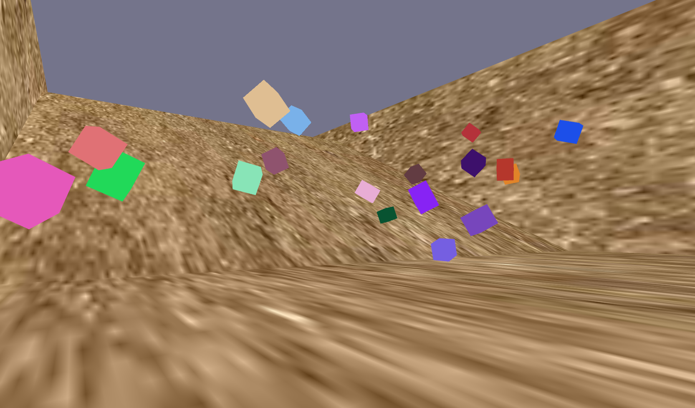

Simple Physics Engine
===================
It's View is based on Unity.
The Physics is implemented in C#

[Demo](https://www.youtube.com/watch?v=K6Fja1hseOY&feature=youtu.be)

### Implement

[Constraint Tutorial](https://www.youtube.com/watch?v=iwEmcWjrcbA&list=PL-yGOsK2iEWjXERY62X2bsa17a2UoA8GK&index=4)
This series course help me to understand what is contraint and how a physics engine work. It is very useful to me.

#### 1. Physics Model

* Update Collision : Update Contact Manifold From Collision Model
* Compute Island : Compute Island to Solve Constraint(Ignore object if it is sleeping, and no object collide with it)
* Solve Contact : Impulsed base response, Penetration constraint
* Update Sleep State : Change the object state if its linear velocity and angular velocity stay at low speed for a period of time

#### 2. Collision Model

* GJK Algorithm : Check overlap, Get EPA Start Simplex
* EPA Algorithm : Get Penetration Vector, Penetration Depth
* Clipping : Get Contact Points By Clipping, Get Contact Manifold
* Update Contact Points for warm start(Use Distance between Contact Points)

